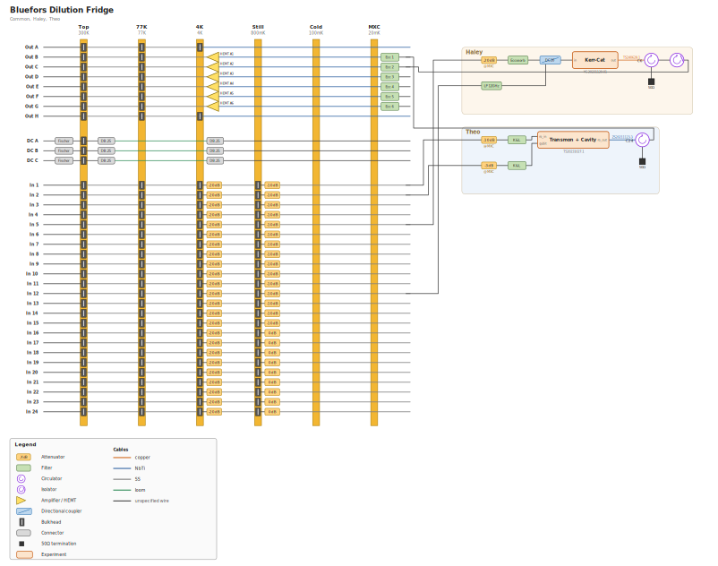

# Wiagram

Turn plain-text fridge wiring files into one SVG and/or PDF diagram.

Each person keeps their own file (`theo.txt`, `haley.txt`, …) next to a shared
`common.txt`. Wiagram merges them and draws the whole fridge. Wiring changes
live in git like code.



*Output of `python3 -m wiagram build example/`  fridge lines on the left,
owner bands on the right.*

## Install / run

No install step. From the repo root:

```bash
python3 -m wiagram check example/                 # validate only
python3 -m wiagram build example/                 # writes example/wiring.svg
python3 -m wiagram build example/ -o out.svg      # choose the SVG path
python3 -m wiagram build example/ --pdf out.pdf   # SVG + PDF (needs cairosvg)
```

For PDF format:

```bash
pip install cairosvg
```

You can pass a directory of `.txt` files, or list files explicitly:

```bash
python3 -m wiagram build example/common.txt example/theo.txt -o theo.svg
```

`common.txt` is always loaded first when it is among the inputs.

| Command | What it does |
|---------|----------------|
| `check` | Parse and validate. Prints counts; exits `1` on errors. |
| `build` | Same as check, then writes an SVG (and optional PDF). |

## File layout

A typical fridge folder looks like:

```
fridge/
  common.txt    # plates, line templates, line list (shared)
  theo.txt      # Theo's devices + wiring
  haley.txt     # Haley's devices + wiring
```

Then:

```bash
python3 -m wiagram build fridge/ -o fridge/wiring.svg
```

## Your wiring file

Minimal shape:

1. Optional metadata (`owner: …`)
2. `[device …]` / `[cable …]` declarations
3. A `[wiring]` section of arrow chains

Example (`theo.txt`-style):

```
owner: Theo

[device cavity]
type: experiment
label: Transmon + Cavity
serial: TS20231027-1
plate: MXC
ports: ro_in:W, qubit:W, ro_out:E

[device c24]
type: circulator
label: C24

[cable nb1]
type: NbTi
serial: ZS20211123-3

[wiring]
In 1 -> -10dB@MXC -> knl -> cavity.ro_in
In 2 -> -3dB@MXC -> knl -> cavity.qubit
cavity.ro_out -> nb1 -> c24.1
c24.2 -> Out B
c24.3 -> term
```

Chains read **left → right**: fridge line toward your experiment (or back out
to an output line).

### What can appear in a chain?

| Kind | How to write it | Notes |
|------|-----------------|--------|
| Fridge line | `In 1`, `Out B`, `DC A` | Defined in `common.txt`. Each line can be used **once** across all files. |
| Inline 2-port | `-20dB`, `knl`, `hemt(A1)`, … | No declaration needed. |
| Plate anchor | `-10dB@MXC` | Pins that part to a plate column. |
| Declared device | `cavity.ro_in`, `c24.1` | Use `name.port`. |
| Declared cable | `… -> nb1 -> …` | Goes between two components. |

Inline parts you can type directly:

```
-20dB   0dB   eccosorb   knl   lp(12GHz)   hp(...)   bp(...)
filter(anything)   hemt(A1)   amp(SPA)   iso   isolator
bulkhead   db25   fischer   sma   term   term(50)
cable(NbTi)   biastee   circ(C24)   coupler
```

`#` starts a comment. A chain can wrap across lines if the continued line
ends with `->`.

### Declaring devices and cables

**Devices** (multi-port or anything you want named):

```
[device name]
type: circulator | isolator | coupler | biastee | experiment | …
label: optional display name
serial: optional
plate: MXC          # optional default plate
ports: a:W, b:E     # required for experiment/device; optional :W/:E/:N/:S
```

Default ports if you do not list them:

- circulator → `1`, `2`, `3`
- coupler → `in`, `out`, `cpl`, `iso`
- bias tee → `rf`, `dc`, `out`
- most others → `in`, `out`

**Cables** (for serials / wire color):

```
[cable nb1]
type: NbTi          # copper, SS, NbTi, premade, flex, loom, …
serial: ZS20211123-3
```

Use the cable name between two parts: `cavity.ro_out -> nb1 -> c24.1`.

## `common.txt` (shared fridge)

Holds things that rarely change: temperature plates, line templates, and the
list of fridge lines.

```
owner: Common
fridge: Bluefors Dilution Fridge

[plates]
Top: 300K
77K: 77K
4K: 4K
Still: 800mK
Cold: 100mK
MXC: 20mK

[template input_line]
group: Inputs
chain: bulkhead@Top -> cable(SS) -> bulkhead@77K -> cable(SS) -> bulkhead@4K ->
       -20dB@4K -> cable(SS) -> bulkhead@Still -> {still}@Still -> cable(SS)

[lines]
In 1..In 15: input_line(still=-10dB)
In 16..In 24: input_line(still=0dB)
```

- `[plates]`  vertical plate bars on the diagram (names used by `@Plate`).
- `[template name]`  reusable chain; `{param}` is filled in per line.
- `[lines]`  creates each fridge line from a template. Ranges work:
  `In 1..In 24`, `Out A..Out H`, `DC A..DC C`.
- `direction: out` on a template flips amplifier symbols for outgoing lines.
- `group:` controls vertical grouping (Outputs / DC / Inputs).

See `example/common.txt` for a full fridge.

## What the diagram looks like

- **Left:** fridge lines as horizontal tracks, plates as vertical bars.
- **Right:** one tinted band per owner; each `[wiring]` chain is a row.
- Chains that continue from the previous chain’s rightmost part stay on the
  same row; a hang off a downward port (e.g. circulator `3` → `term`) drops
  below.
- Same text always produces the same layout.